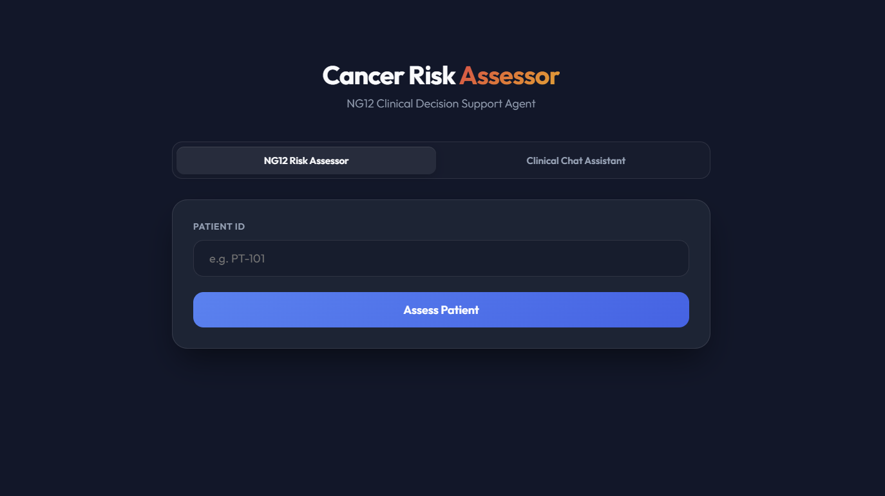
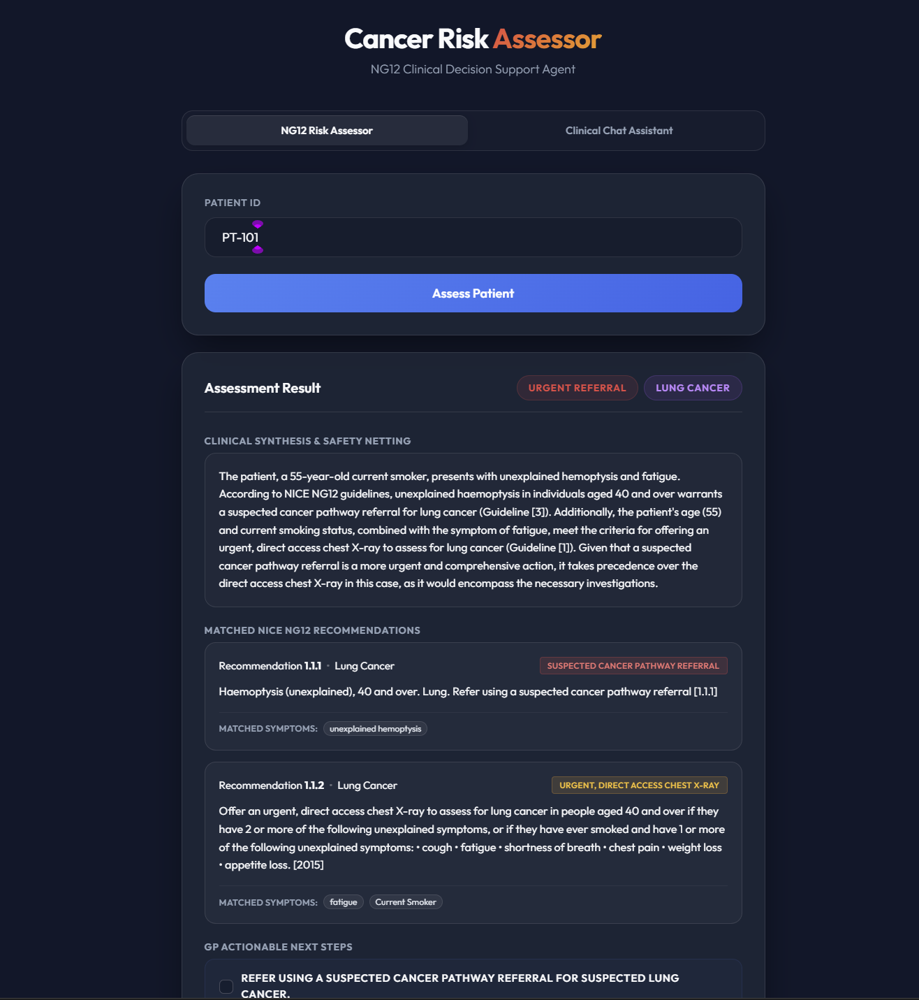
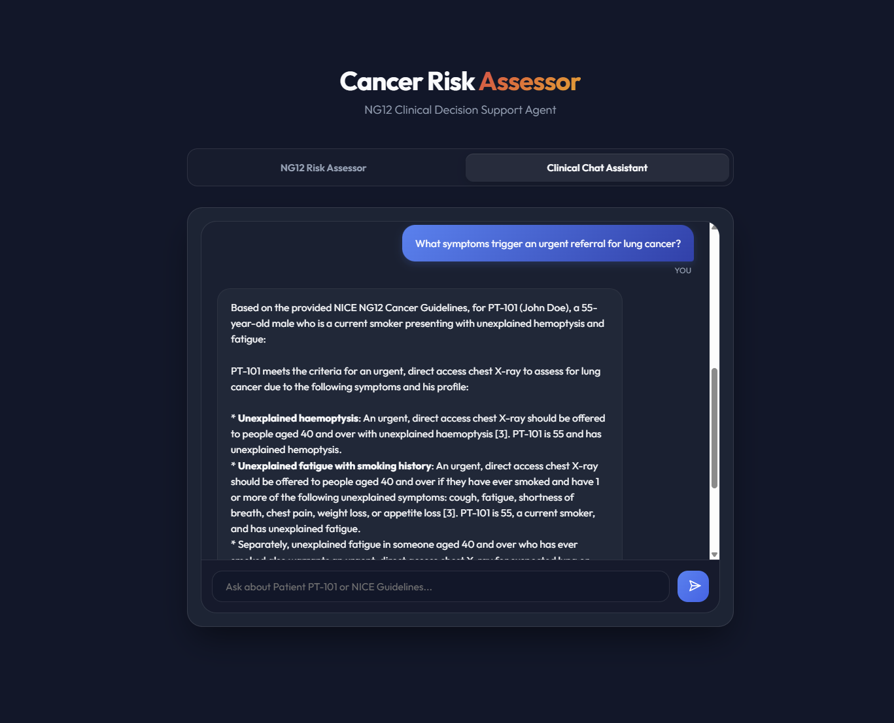

# NG12 Cancer Risk Assessor

A FastAPI + Docker application that assesses cancer risk from structured patient data and supports conversational Q&A over the NICE NG12 guideline corpus.

## Features

- Patient risk assessment by Patient ID
- Conversational NG12 chat assistant
- Structured citations for guideline excerpts
- Chroma-backed retrieval service
- Docker Compose setup for local launch

## Prerequisites

- Docker Desktop
- Docker Compose
- Optional: Google Cloud application default credentials for Vertex AI access
- A valid API configuration in app_config.json or environment variables for Vertex AI

## Project layout

- api/ - FastAPI app, frontend, prompts, and patient data
- chroma/ - vector search service and ingestion pipeline
- docker-compose.yml - launches both services

## How to launch

### 1) Start Docker Desktop
Make sure Docker is running before continuing.

### 2) Build and start the services
From the project root, run:

```bash
docker-compose down
docker-compose build
docker-compose up -d
```

If you are using PowerShell, the commands above should be run as separate lines or separated with semicolons.

### 3) Open the application
- Web app: http://localhost:8000
- Chroma service health: http://localhost:8001/health

## Credentials

The application does not need a committed credentials file.

At runtime, the web container mounts the host Google Cloud application default credentials into the container as /app/credentials.json.

If you do not have credentials available, the app can still start, but AI calls that depend on Vertex AI will fail until credentials are configured.

## App configuration

Before starting the app, update [app_config.json](app_config.json) with your own Vertex AI settings.

The Docker setup mounts this root-level file into the web container automatically.

The file must include:

- vertex_ai.model_name
- vertex_ai.project

You can also override these values with environment variables:

- VERTEX_MODEL_NAME
- VERTEX_PROJECT

If the configuration is missing or invalid, the app will fail to start.

## Screenshots

### Overview


### Risk assessor


### Chat assistant


## Notes

- The patient lookup data is stored in api/patients.json.
- The prompt files live under api/prompts/.
- Chroma builds its local index on container start.

## Troubleshooting

### Port already in use
If port 8000 or 8001 is already occupied, stop the conflicting container or process and try again.

### No credentials found
Confirm that your Google Cloud application default credentials exist on the host and that docker-compose.yml points to the correct path.

### Rebuild after changes
If you change Python dependencies or Docker configuration, rebuild the containers:

```bash
docker-compose build
```

## License

No license has been specified for this project.
